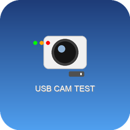

# USB Camera Hardware Test Suite v2.0

A professional macOS application for comprehensive USB camera hardware testing and validation, specifically designed for **WN-L2307k368 48MP camera modules** used in photobooth applications.



## 🎯 Overview

This application provides rigorous hardware testing and validation for USB camera modules to ensure they meet quality standards for commercial photobooth deployments. It performs 10+ comprehensive tests covering image quality, autofocus accuracy, exposure control, and hardware stability.

## ✨ Features

### Core Testing Capabilities
- **🔍 PDAF (Phase Detection AutoFocus) Testing** - Validates autofocus accuracy and speed
- **📸 Image Quality Assessment** - Comprehensive sharpness, noise, and color analysis
- **⚡ Exposure Control Validation** - Tests auto-exposure accuracy across lighting conditions
- **📊 Resolution & Format Testing** - Validates all supported resolutions and formats
- **🎨 Color Accuracy Testing** - Ensures accurate color reproduction
- **⚙️ Hardware Stress Testing** - Extended operation validation
- **📈 Performance Benchmarking** - Frame rate and latency measurements
- **🔧 Hardware Diagnostics** - USB interface and power consumption analysis

### Professional Reporting
- **📋 Detailed Test Reports** - Comprehensive PDF reports with pass/fail criteria
- **📊 Performance Metrics** - Quantitative measurements and benchmarks
- **🎯 Photobooth Compatibility** - Specific validation for commercial photobooth use
- **📈 Trend Analysis** - Historical performance tracking

### User Experience
- **🖥️ Native macOS Application** - Professional GUI with intuitive interface
- **🚀 One-Click Installer** - Professional DMG installer with automatic dependency management
- **📱 Real-time Preview** - Live camera feed during testing
- **⚡ Fast Testing** - Complete test suite runs in under 5 minutes

## 🛠️ Installation

### Requirements
- macOS 10.14+ (Mojave or later)
- Python 3.8+ (automatically installed if needed)
- USB 2.0+ port
- WN-L2307k368 48MP camera module

### Quick Install
1. Download the latest `USB_Camera_Tester_Installer_v2.0.dmg`
2. Double-click to mount the disk image
3. Run `USB Camera Tester Installer.app`
4. Follow the installation prompts
5. Launch from Applications folder

The installer automatically:
- Downloads the latest version
- Installs Python dependencies (OpenCV, NumPy, Pillow, etc.)
- Creates a native macOS application
- Sets up desktop integration

## 🧪 Camera Specifications

**Target Hardware: WN-L2307k368 48MP Camera Module**

| Specification | Value |
|---------------|-------|
| **Sensor** | Samsung S5KGM1ST ISOCELL GM1 |
| **Resolution** | 8000×6000 (48MP), 4000×3000 (12MP binned) |
| **Pixel Size** | 0.8μm |
| **Optical Format** | 1/2 inch |
| **Interface** | USB 2.0 |
| **Autofocus** | PDAF (Phase Detection) |
| **Frame Rate** | Up to 8fps @ 48MP |
| **Formats** | MJPEG, YUY2 |
| **Features** | HDR, WDR, Tetrapixel binning |

## 📋 Test Suite Details

### 1. **Image Sharpness Test**
- Measures optical sharpness across the frame
- Validates focus accuracy in center and corners
- **Pass Criteria**: Sharpness score > 2000 Laplacian variance

### 2. **PDAF Autofocus Test** 🎯
- **Critical for photobooth applications**
- Tests focus speed and accuracy
- Validates focus hunting behavior
- **Pass Criteria**: All 3 focus tests must succeed

### 3. **Exposure Control Test**
- Tests auto-exposure in various lighting conditions
- Validates exposure consistency
- **Pass Criteria**: Proper exposure across 80-180 brightness range

### 4. **Color Accuracy Test**
- Validates color reproduction and white balance
- Tests color consistency across conditions
- **Pass Criteria**: Balanced RGB values within tolerance

### 5. **Resolution Test**
- Validates all supported resolutions
- Tests format compatibility (MJPEG, YUY2)
- **Pass Criteria**: All advertised resolutions functional

### 6. **Frame Rate Test**
- Measures actual vs. advertised frame rates
- Tests performance under load
- **Pass Criteria**: Achieves target FPS ±10%

### 7. **Noise Reduction Test**
- Evaluates noise performance in low light
- Tests digital noise reduction effectiveness
- **Pass Criteria**: SNR improvement demonstrated

### 8. **HDR Capability Test**
- Tests High Dynamic Range functionality
- Validates exposure bracketing
- **Pass Criteria**: HDR processing functional

### 9. **USB Interface Test**
- Validates USB communication stability
- Tests power consumption
- **Pass Criteria**: Stable USB enumeration

### 10. **Hardware Stress Test**
- Extended operation test (thermal)
- Long-term stability validation
- **Pass Criteria**: No failures during 30-minute test

## 📊 Photobooth Validation

**Critical for Commercial Photobooth Deployment:**

- ✅ **Consistent Focus** - PDAF system must work reliably
- ✅ **Fast Startup** - Camera ready in <3 seconds
- ✅ **Stable Operation** - No crashes during extended use
- ✅ **Quality Images** - Sharp, well-exposed photos consistently
- ✅ **USB Reliability** - Stable connection over time

**Strict Pass/Fail Criteria:** Cameras must pass ALL tests to be approved for photobooth use.

## 🚀 Usage

### Basic Testing
1. Launch **USB Camera Tester** from Applications
2. Connect your WN-L2307k368 camera via USB
3. Click **"Connect Camera"** and grant camera permissions
4. Select desired tests or click **"Run All Tests"**
5. Wait for test completion (~5 minutes)
6. Review results and generate PDF report

### Advanced Features
- **Custom Test Sequences** - Create specific test combinations
- **Batch Testing** - Test multiple cameras sequentially
- **Historical Analysis** - Track camera performance over time
- **Export Data** - CSV export for further analysis

## 📁 Project Structure

```
kamv2/
├── camera_test_suite/          # Main application source
│   ├── main.py                 # Core testing application
│   ├── icons/                  # Application icons and branding
│   ├── test_images/            # Reference images for testing
│   └── create_logo.py          # Icon generation utility
├── installer_build/            # Installer configuration
│   └── USB Camera Tester Installer.app
├── build_installer.sh          # Build script for installer
├── USB_Camera_Tester_Simple_Installer.py  # Installation logic
└── USB_Camera_Testing_Capabilities_Report.md  # Technical documentation
```

## 🔧 Development

### Building from Source
```bash
git clone https://github.com/aaronsimo13/kamv2.git
cd kamv2
./build_installer.sh
```

### Dependencies
- **OpenCV** - Camera interface and image processing
- **NumPy** - Numerical computations
- **Pillow** - Image manipulation
- **Matplotlib** - Data visualization
- **ReportLab** - PDF report generation
- **PSUtil** - System monitoring

## 📈 Version History

### v2.0 (Current)
- ✨ **Professional Logo & Branding** - Custom designed icon set
- 🚀 **Enhanced Installer** - Streamlined installation process
- 🔧 **Improved Stability** - Fixed GUI and crash issues
- 📊 **Better Reporting** - Enhanced test result documentation
- 🎯 **Photobooth Focus** - Specialized validation for commercial use

### v1.0
- Initial release with core testing functionality
- Basic GUI and test suite implementation

## 🤝 Contributing

This is a specialized testing tool for specific hardware. For issues or improvements:

1. Report issues via GitHub Issues
2. Fork the repository for modifications
3. Submit pull requests for enhancements
4. Follow existing code style and testing patterns

## 📄 License

Professional hardware testing tool for commercial photobooth applications.

## 📞 Support

For technical support, hardware validation questions, or commercial deployment assistance, please create an issue on GitHub with detailed information about your testing requirements.

---

**Built for reliable photobooth camera validation** 📸✨